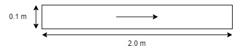

# Two-dimensional pipe flow

Laminar flow in a pipe with lenth of 2.0 meters, and a diameter of 0.1 meter.\n

## Physical properties
The fluid flow at the inlet is taken to be 1.0 m/s. The kinematic viscosity is set to 0.001 m^2/s, resulting in a Reynolds number of 100.

## Boundary conditions
The following boundary conditions are defined:

|Boundary | U (m/s) | p (N/m^2)|
|---|---|---|
|Inlet| 1 (uniform) | zero gradient|
|Outlet|zero gradient| 0 (uniform) |
|BottomWall|no slip|zero gradient|
|TopWall|no slip|zero gradient|
|Front|empty|empty|
|Back|empty|empty|
|---|---|---|
